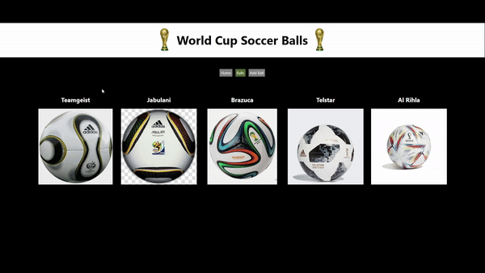

# World Cup Soccer Balls

This website allows you to check out different World Cup soccer balls as well as add any additional balls that may be missing.

## Scripts

In the project directory, run:

### `json-server --watch db.json`

Run this script to so that the contents of the database can be retrieved 
and shown in the website.

### `npm start`

Run this script to start the application.

## Usage

### Balls Tab

In the Balls tab, you can view all the World Cup official balls.

By clicking on the ball, it will display the year the ball was released as well as the competition it was used in. 

### Add Balls Tab

In this tab you can add any ball that is missing. Simply fill out the form hit the submit button and Voila! Go back to the Balls tab and you will see the ball you added displayed along with the rest.

## Contributions

This website is for viewing purposes only. If you have any questions please open an issue.